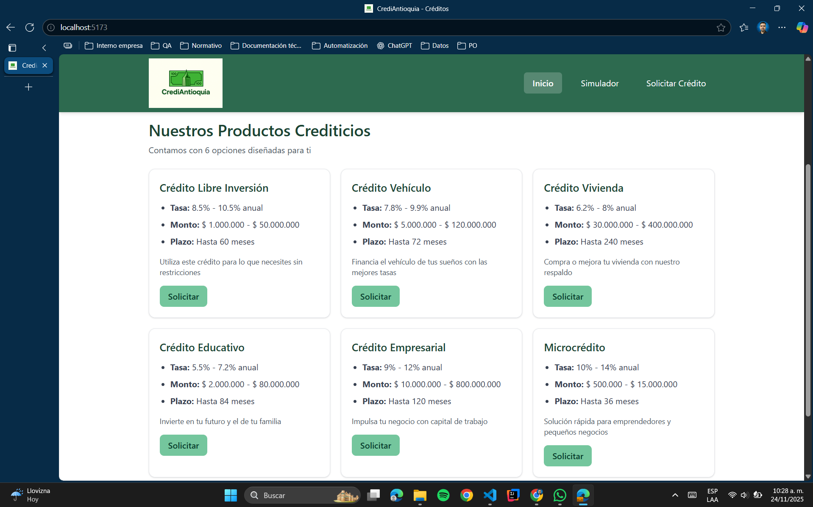
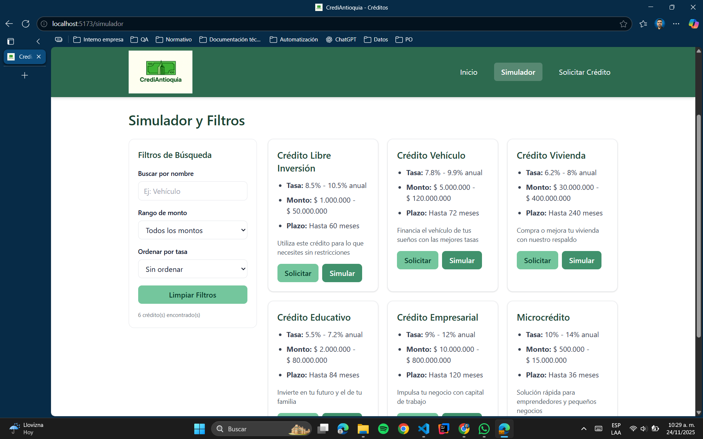
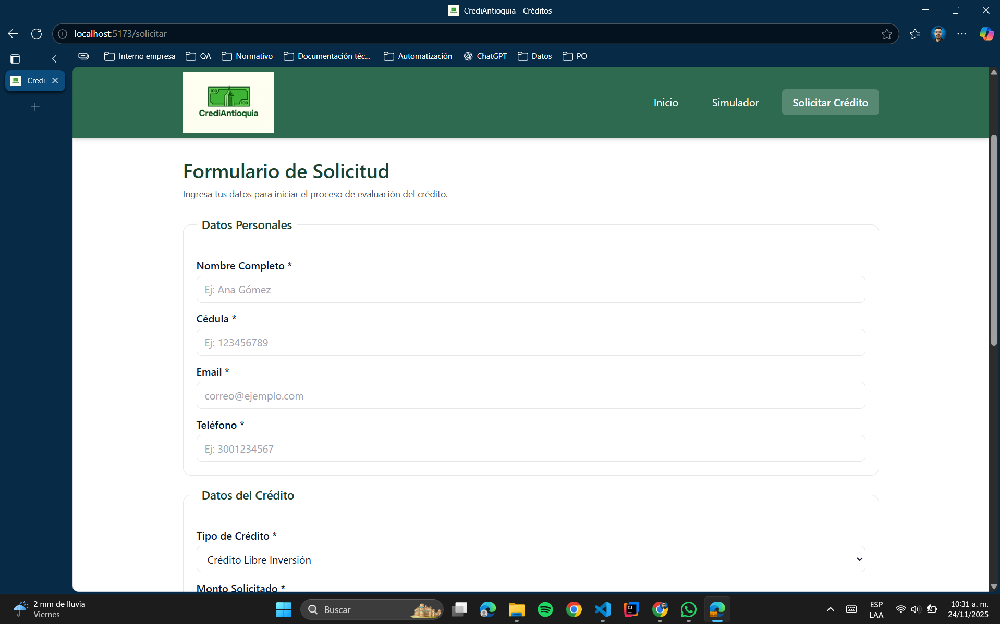
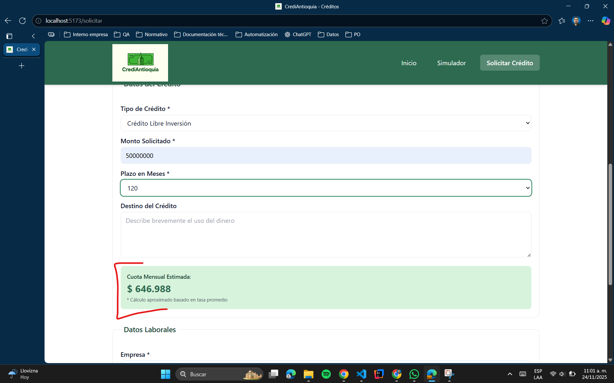

# CrediSmart - Aplicación React de Créditos

## 📋 Descripción del Proyecto

CrediAntioquia es una aplicación web interactiva desarrollada con React que permite a los usuarios explorar diferentes productos crediticios, simular créditos con filtros dinámicos y enviar solicitudes de crédito con validación en tiempo real.

Este proyecto fue desarrollado como parte de la **Actividad 2 - Desarrollo de Aplicación Web Dinámica con React** para el curso de Ingeniería Web en IUDigital.

## 👨‍💻 Estudiante

**Nombre:** Lisa Mariana Larrea - Julián Alberto Isaza  
**Institución:** IU Digital  
**Curso:** Ingeniería Web  
**Período:** 2025-02

## 🚀 Tecnologías Utilizadas

- **React 18.3.1** - Biblioteca de JavaScript para construir interfaces de usuario
- **Vite 5.4.11** - Herramienta de construcción rápida para proyectos frontend
- **React Router DOM 6.27.0** - Enrutamiento declarativo para aplicaciones React
- **Tailwind CSS 3.4.15** - Framework de CSS utilitario
- **JavaScript ES6+** - Lenguaje de programación moderno

## ✨ Características Implementadas

### 🏠 Página de Inicio
- Lista dinámica de productos crediticios renderizada con `.map()`
- Componente `CreditCard` reutilizable con props
- Datos obtenidos desde `creditsData.js`
- Diseño responsive con Tailwind CSS

### 🔍 Página Simulador
- **Búsqueda en tiempo real** por nombre de crédito
- **Filtro por rango de monto** (Bajo, Medio, Alto)
- **Ordenamiento por tasa de interés** (Menor a Mayor / Mayor a Menor)
- Uso de `useState` para manejo de estado
- Uso de `.filter()` para filtrar resultados
- Uso de `.sort()` para ordenar por tasa
- Mensaje "No hay créditos disponibles" cuando no hay resultados
- Contador de créditos filtrados

### 📝 Página Solicitar Crédito
- **Formulario 100% controlado** con `useState`
- **Validaciones en tiempo real**:
  - Email con formato válido
  - Cédula de 6-10 dígitos
  - Teléfono de 10 dígitos
  - Monto dentro del rango permitido
- **Cálculo automático de cuota mensual** usando fórmula financiera
- Actualización dinámica al cambiar monto o plazo
- Formato de moneda en COP
- Mensajes de error específicos
- Mensaje de éxito tras envío
- Limpieza automática del formulario
- Almacenamiento de solicitudes en array (memoria)
- Prevención de envío con `preventDefault()`

### 🧭 Navegación
- Componente `Navbar` sticky con React Router
- Links activos resaltados con `NavLink`
- Menú hamburguesa responsive para móviles
- Estado para controlar apertura/cierre del menú

## 📁 Estructura del Proyecto

```
credismart-react/
├── public/
│   └── logoCrediAntioquia.png
├── src/
│   ├── components/
│   │   ├── Navbar.jsx
│   │   └── CreditCard.jsx
│   ├── data/
│   │   └── creditsData.js
│   ├── pages/
│   │   ├── Home.jsx
│   │   ├── Simulador.jsx
│   │   └── Solicitar.jsx
│   ├── App.jsx
│   ├── main.jsx
│   └── index.css
├── .gitignore
├── index.html
├── package.json
├── postcss.config.js
├── tailwind.config.js
├── vite.config.js
└── README.md
```

## 🛠️ Instalación y Configuración

### Prerrequisitos

Antes de comenzar, asegúrate de tener instalado:
- **Node.js** (versión 18 o superior)
- **npm** (viene incluido con Node.js)

### Pasos de Instalación

1. **Descarga Node.js** desde https://nodejs.org/ e instálalo

2. **Clona o descarga este repositorio**

3. **Navega a la carpeta del proyecto**
   ```bash
   cd credismart-react
   ```

4. **Instala las dependencias**
   ```bash
   npm install
   ```

5. **Inicia el servidor de desarrollo**
   ```bash
   npm run dev
   ```

6. **Abre tu navegador** en la URL que aparece en la consola (generalmente `http://localhost:5173`)

## 📦 Scripts Disponibles

```bash
# Iniciar servidor de desarrollo
npm run dev

# Compilar para producción
npm run build

# Vista previa de la compilación de producción
npm run preview
```

## 🎯 Conceptos de React Aplicados

### Hooks Utilizados
- ✅ `useState` - Manejo de estado en todos los componentes
- ✅ `useEffect` - Para filtros automáticos en Simulador
- ✅ `useLocation` - Para recibir estado desde navegación

### Manipulación de Arrays
- ✅ `.map()` - Renderizar listas de créditos con keys únicas
- ✅ `.filter()` - Filtrar créditos por búsqueda y rango
- ✅ `.sort()` - Ordenar por tasa de interés
- ✅ `.find()` - Buscar crédito específico

### Componentes
- ✅ Componentes funcionales bien estructurados
- ✅ Props con desestructuración
- ✅ Un componente por archivo
- ✅ Componentes reutilizables (`Navbar`, `CreditCard`)

### Formularios
- ✅ Formulario controlado con estado
- ✅ Validación en tiempo real
- ✅ Manejo de eventos con `onChange` y `onSubmit`
- ✅ Prevención de comportamiento por defecto

### Estilos
- ✅ Tailwind CSS para diseño responsive
- ✅ Clases condicionales con template literals
- ✅ Estilos inline cuando es necesario

## 📸 Capturas de Pantalla

### Página de Inicio


### Simulador con Filtros


### Formulario de Solicitud


### Funcionamiento de la simulación


## 🔄 Commits Realizados

1. ✅ Configuración inicial de React con Vite
2. ✅ Estructura de carpetas y archivos base creada
3. ✅ Componente Navbar implementado con React Router
4. ✅ Componente CreditCard creado con props
5. ✅ Página Home con lista dinámica de créditos
6. ✅ Búsqueda en tiempo real implementada en Simulador
7. ✅ Filtros dinámicos y ordenamiento agregados
8. ✅ Formulario controlado con validaciones creado
9. ✅ Cálculo de cuota mensual funcionando
10. ✅ Estilos responsive finalizados
11. ✅ README documentado completamente
12. ✅ Proyecto finalizado y listo para entrega

## 🎓 Aprendizajes Clave

- Programación orientada a componentes en React
- Manejo de estado con hooks (`useState`, `useEffect`)
- Enrutamiento con React Router DOM
- Manipulación avanzada de arrays (`.map()`, `.filter()`, `.sort()`)
- Formularios controlados y validación
- Cálculos dinámicos en tiempo real
- Diseño responsive con Tailwind CSS
- Buenas prácticas en Git (commits descriptivos)

## 🐛 Solución de Problemas

### El proyecto no inicia
```bash
# Elimina node_modules y reinstala
rm -rf node_modules
npm install
npm run dev
```

### Errores de importación
Asegúrate de que la estructura de carpetas coincida con las importaciones en los archivos.

### Estilos no se aplican
Verifica que Tailwind CSS esté correctamente configurado en `tailwind.config.js` y que `index.css` incluya las directivas de Tailwind.

## 📞 Contacto

Si tienes preguntas sobre este proyecto, puedes contactarme a través de:
- **GitHub:** [JulianISGON](https://github.com/JulianISGON)
- **Email:** [julian.isaza1020@gmail.com]

## 📄 Licencia

Este proyecto es de uso educativo para IU Digital.

---

**Desarrollado por Lisa y Julián para IU Digital - 2025**
